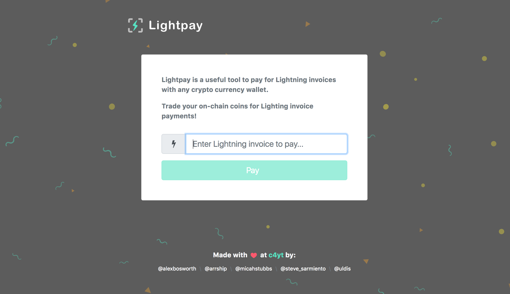

# LightPay
### Pay lightning with any bitcoin wallet
Atomic swaps for the Lightning Payment Network
@ C4YT Hackathon

LightPay Team
@alexbosworth @micahstubbs @arrship @steve_sarmiento @uldis

### The Problem 
While the lightning network is allowing for faster transaction processing through open channel payments allowing for cheaper fees. Adoption will take time to reach a wider audience. 
Lightpay allows for wider user adoption without having the barrier of entry of running a lightning node to make a lightning payment.

Jim is trying to purchase a guitar on craigslist from Pam. 
Turns out Pam is only taking lightning network payments but Jim doesn’t have a lightning wallet/node to pay the invoice Pam created for the sale of her item. 
What does Jim do? 

### Enter LightPay
Lightpay chooses a swap provider that is willing and able to pay Pam’s lightning invoice through an atomic swap allowing for any coin to be used.
The swap provider takes a small fee from Jim and then pays the invoice in question on Jim’s behalf.
A swap provider is a user in the Lightpay network that is willing to fulfill an invoice.  A provider is already running the lightning node and bcoin node that is required.  

Lightpay makes it easy for any user anywhere to use the lightning network. 
Lightpay makes it easy for a user with any bitcoin wallet to pay lightning invoices.
Lightpay makes it easy for any user to become a swap provider.
Lightpay makes it easy to pay a lightning invoice without needing to mess with code to spin up a lightning node or a bitcoin full node.

